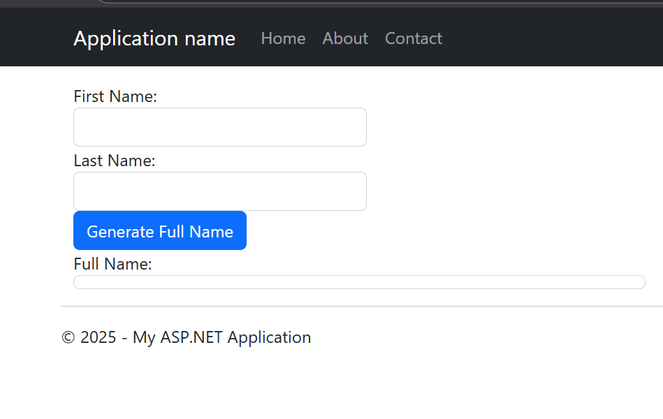
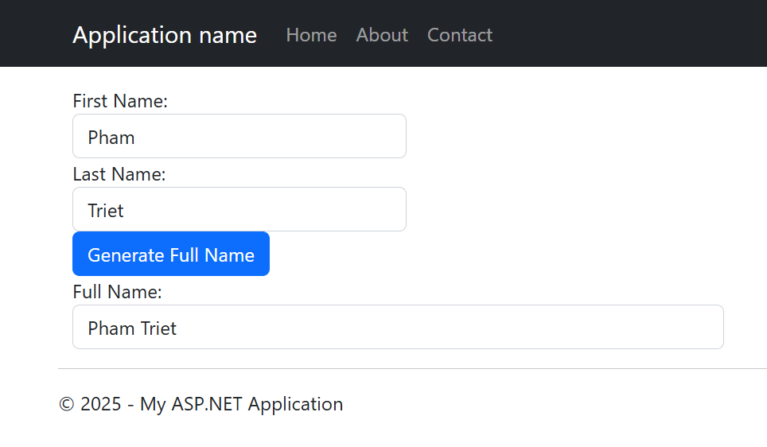

# ASP.NET Web Forms Training - Exercise 1
*Date: April 28, 2024*

## Bài tập 1: Tạo trang Default.aspx với chức năng ghép tên

### Yêu cầu:
Tạo một trang web sử dụng MasterPage để thực hiện chức năng ghép tên (First Name + Last Name = Full Name)

### Giao diện và kết quả:



### Các bước thực hiện:

1. **Tạo trang Default.aspx**
   - Sử dụng MasterPage (Site.Master)
   - Thêm các control cần thiết:
     - TextBox với ID=txtFirstName
     - TextBox với ID=txtLastName
     - Label với ID=blFullName
     - Button với ID=btnGenFullname

2. **Thiết kế giao diện**
   - Sử dụng Bootstrap để tạo layout đẹp
   - Đặt các control trong container và row
   - Sử dụng form-group để nhóm các control
   - Thêm CSS class form-control cho TextBox
   - Thêm CSS class btn btn-primary cho Button

3. **Xử lý sự kiện**
   - Double click vào Button để tạo sự kiện Click
   - Viết code xử lý trong Default.aspx.cs
   - Sử dụng string interpolation để ghép tên: `$"{txtFirstName.Text} {txtLastName.Text}"`

4. **Khai báo control trong Designer**
   - Mở file Default.aspx.designer.cs
   - Thêm khai báo cho các control:
     ```csharp
     protected global::System.Web.UI.WebControls.TextBox txtFirstName;
     protected global::System.Web.UI.WebControls.TextBox txtLastName;
     protected global::System.Web.UI.WebControls.Label blFullName;
     protected global::System.Web.UI.WebControls.Button btnGenFullname;
     ```

5. **Kiểm tra và chạy thử**
   - Build solution
   - Chạy ứng dụng
   - Nhập First Name và Last Name
   - Click nút Generate Full Name
   - Kiểm tra kết quả hiển thị

### Lưu ý quan trọng:
- Luôn đảm bảo khai báo control trong file .designer.cs
- Sử dụng đúng ID cho các control
- Kiểm tra namespace trong các file
- Build solution sau mỗi lần thay đổi code

### Các file liên quan:
- Default.aspx
- Default.aspx.cs
- Default.aspx.designer.cs
- Site.Master (MasterPage)

### Cách sửa lỗi thường gặp:
1. Nếu gặp lỗi "The name 'xxx' does not exist in the current context":
   - Kiểm tra file .designer.cs
   - Đảm bảo đã khai báo control
   - Build lại solution

2. Nếu gặp lỗi "Could not load type 'TrietPhamShopWeb.Global'":
   - Kiểm tra namespace trong Global.asax và Global.asax.cs
   - Clean và build lại solution
   - Kiểm tra file Global.asax.cs có được include trong project 